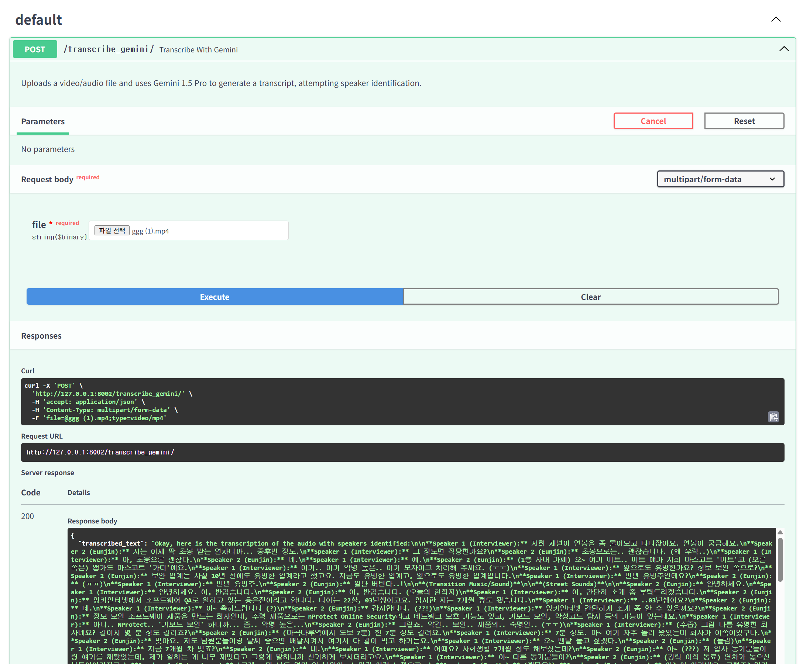

# video to Transcription by gemini fastapi

## table of contents
- [example](#example)


## example
- 1. git clone
```
git clone https://github.com/bamjun/video-to-Transcription-by-gemini-fastapi.git
```

- 2. move to project folder
```
cd video-to-Transcription-by-gemini-fastapi
```

- 3. uv sync
```
uv sync
```

- 4. set token as environment  
  - set in shell  
  ```bash
  export GOOGLE_API_KEY="YOUR_API_KEY_HERE"
  ```

  - set by '.env' file
  ```bash
  echo "GOOGLE_API_KEY='YOUR_API_KEY_HERE'" > .env
  ```

- 5. run server  
  - by uvicorn  
  ```
  uv run uvicorn main:app --reload --port 8002
  ```

  - by python file  
  ```
  uv run python main.py
  ```


- 6. test
```
http://localhost:8002/docs
```


